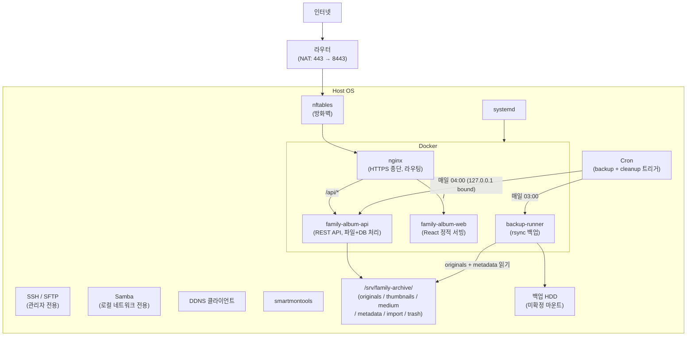
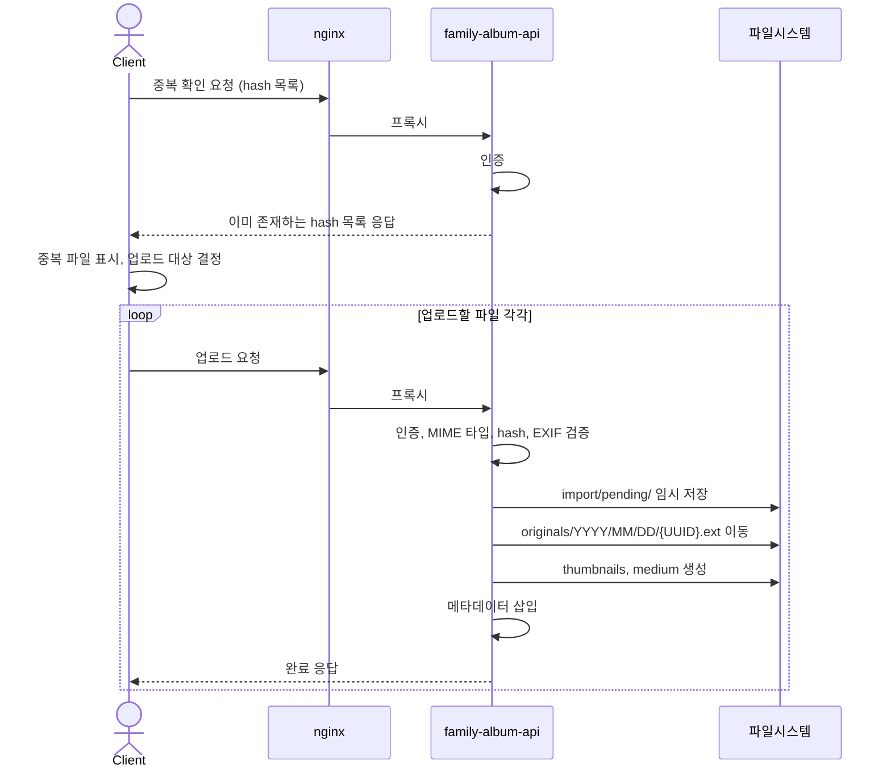
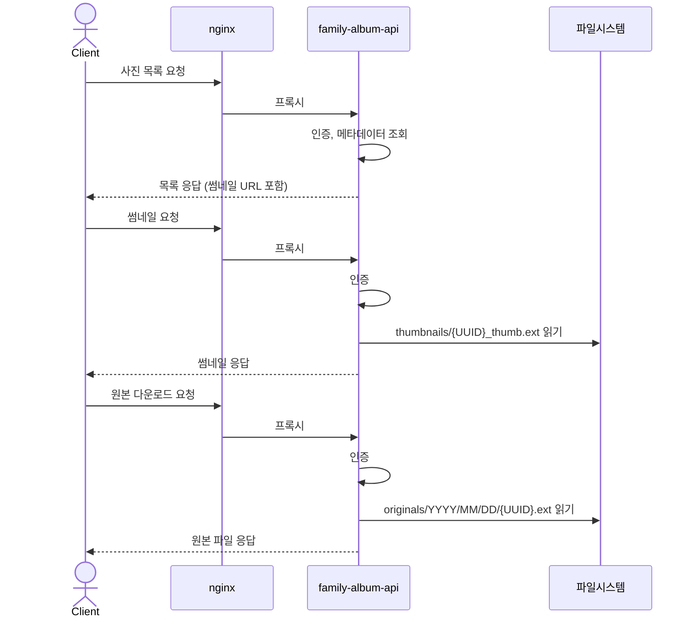
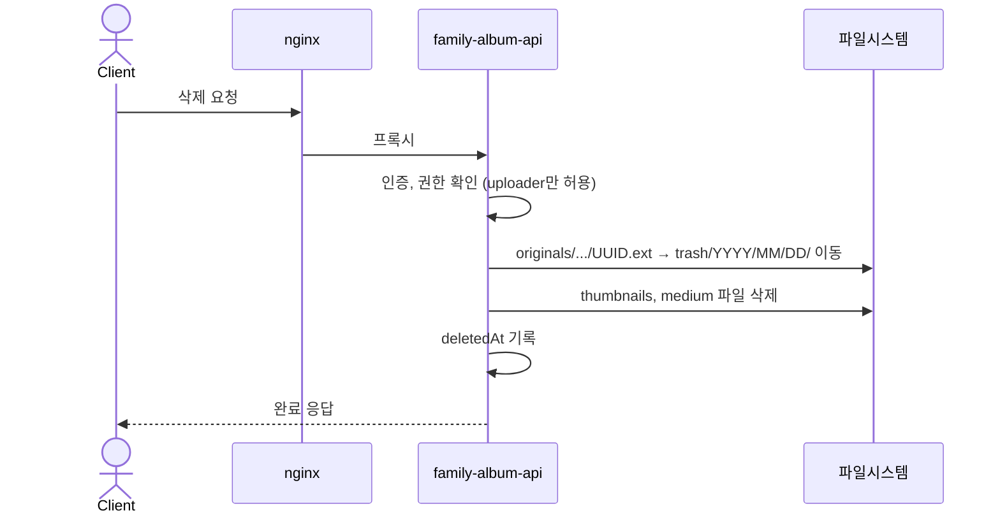
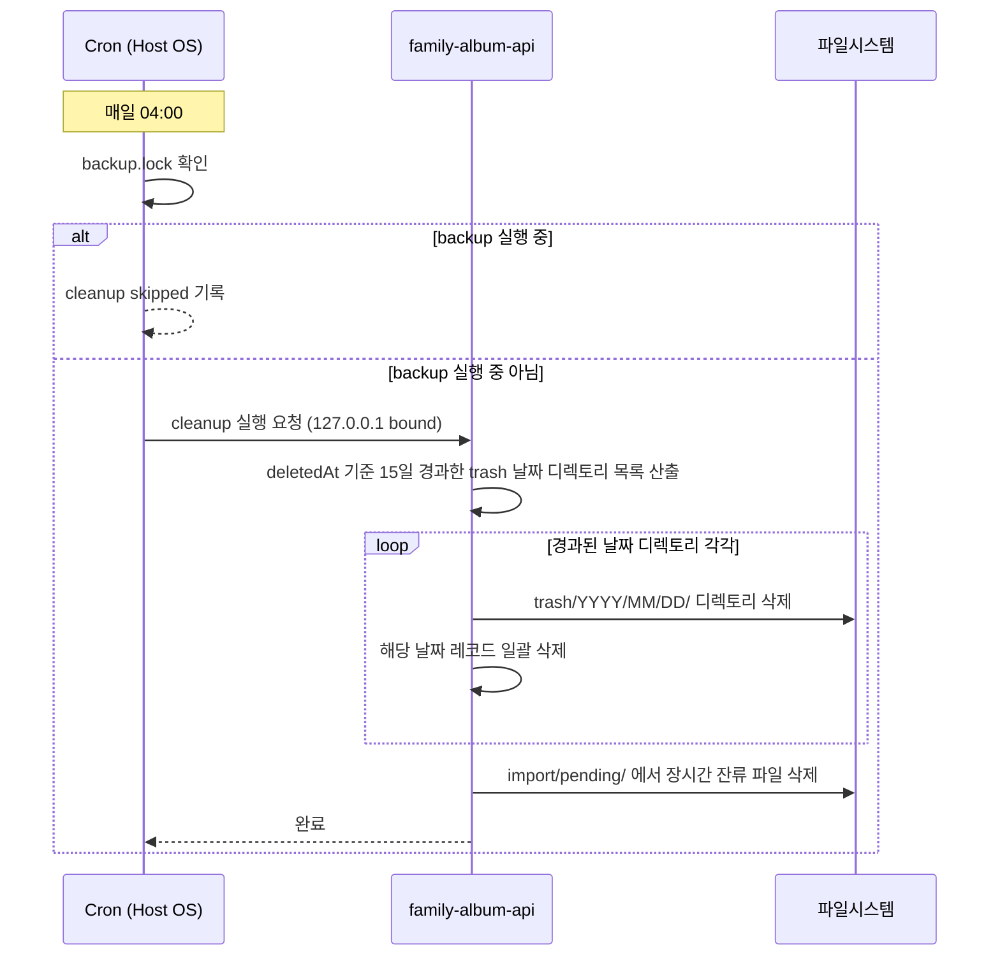
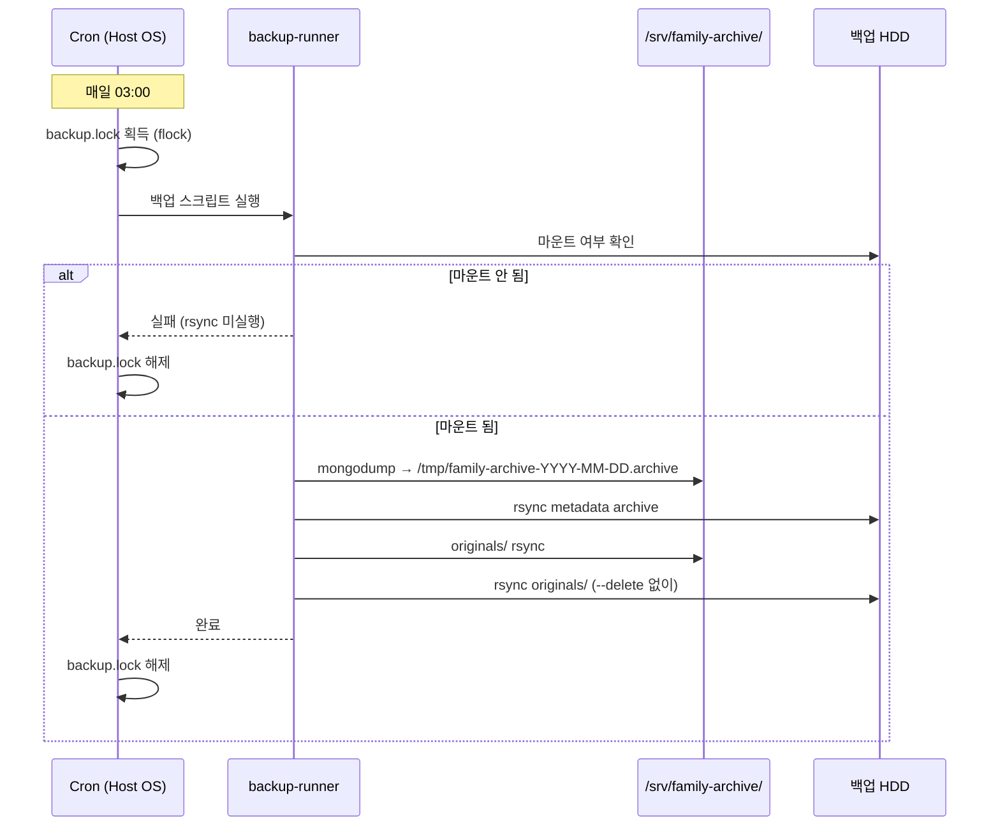

# 시스템 아키텍처 개요

이 문서는 `family-archive-appliance`의 시스템 수준 아키텍처를 정리합니다. 컴포넌트가 어떻게 연결되어 있는지뿐 아니라, 왜 이렇게 나누었는지, 각 컴포넌트의 책임 경계, 데이터 정합성 정책, 장애 시 동작을 다룹니다.

---

## 1. 아키텍처 드라이버

구조적 결정의 우선순위입니다.

| 우선순위 | 드라이버 | 설명 |
|---|---|---|
| 1 | 데이터 영속성 | 원본 사진이 손실되면 복구 불가능. 모든 구조적 결정에서 originals 보호가 최우선. |
| 2 | 단일 운영자 | 개발, 운영, 유지보수를 혼자 한다. 수동 개입이 필요한 복잡한 운영 절차는 선택하지 않는다. |
| 3 | 외부 접근 | 가족(조부모, 친척)이 외부 네트워크에서 접근한다. HTTPS는 필수다. |
| 4 | MVP 제약 | 초기 버전은 기능을 최소화한다. RAID, 얼굴 인식, 복잡한 계정 관리는 범위 밖이다. |
| 5 | 벤더 독립 | 모든 서비스는 Host OS + Docker Compose로 운영한다. 특정 클라우드에 종속되지 않는다. |

---

## 2. 설계 원칙

**Docker는 애플리케이션 실행 경계다.**
컨테이너는 애플리케이션 코드와 그 의존성을 격리합니다. 디스크 마운트, fsck, SMART 확인, 방화벽은 Host OS의 책임입니다. 컨테이너가 죽거나 재배포되어도 데이터는 Host OS 파일시스템에 남습니다.

**변경 이유가 다른 것은 나눈다.**
nginx 라우팅 정책, React UI 코드, API 로직, 백업 스크립트는 각각 독립적인 이유로 변경됩니다. 컨테이너 경계는 배포 단위이자 책임 단위입니다.

**데이터와 코드는 생명주기가 다르다.**
파일시스템에 저장된 originals와 metadata의 생명주기는 컨테이너의 생명주기와 독립적입니다. 컨테이너를 교체해도 데이터는 영향을 받지 않아야 합니다.

---

## 3. 시스템 경계



**Host OS와 Docker의 경계를 나눈 이유:**
- 디스크 마운트, fsck, SMART 확인은 OS 수준 작업입니다. 컨테이너 안에서 처리하면 복구 시나리오가 복잡해집니다.
- Docker daemon 자체에 문제가 생겼을 때 Host OS에서 직접 파일에 접근하고 복구할 수 있어야 합니다.
- 긴급 접근은 SSH로 Host OS에 직접 붙습니다. Docker를 거치지 않습니다.

---

## 4. 데이터 소유권과 저장소 경계

```
/srv/family-archive/
├── originals/        보호 수준: 최고   백업: 필수     소유자: API
│   └── YYYY/MM/DD/{UUID}.ext
├── thumbnails/       보호 수준: 낮음   백업: 불필요   소유자: API (재생성 가능)
│   └── {UUID}_thumb.{ext}
├── medium/           보호 수준: 낮음   백업: 불필요   소유자: API (재생성 가능)
│   └── {UUID}_medium.{ext}
├── metadata/         보호 수준: 높음   백업: 필수     소유자: API (MongoDB 컨테이너 볼륨)
├── import/           보호 수준: 임시   백업: 불필요   소유자: API
│   └── pending/
└── trash/            보호 수준: 임시   백업: 불필요   소유자: API
    └── YYYY/MM/DD/{UUID}.ext
```

metadata는 originals 자체는 아니지만, 조회·중복 판단·삭제 상태·복구에 필요한 상태 데이터입니다. originals가 없어도 metadata만으로는 사진을 복구할 수 없고, metadata가 없으면 originals를 앨범에서 찾을 수 없습니다.

각 영역의 쓰기/삭제 주체:

| 영역 | 쓰기 주체 | 삭제 주체 |
|---|---|---|
| originals | API (업로드) | API (삭제 시 trash로 이동) |
| thumbnails | API (업로드) | API (삭제 시) |
| medium | API (업로드) | API (삭제 시) |
| metadata | API | API |
| import/pending | API | API |
| trash | API (삭제 시 이동) | API (Cron cleanup 트리거에 의해) |

파일시스템에 대한 모든 쓰기/삭제 작업은 `family-album-api`를 통해서만 수행됩니다. Host OS Cron은 API를 트리거할 뿐, 파일시스템을 직접 조작하지 않습니다.

backup-runner는 `/srv/family-archive/originals`와 운영 DB를 변경하지 않습니다. DB snapshot 생성 및 백업 HDD로의 쓰기는 수행합니다.

---

## 5. 책임 경계

### 5.1 nginx

nginx가 하는 것:
- HTTPS 종단 (TLS 인증서 관리, 암복호화)
- 포트 수신 (8443)
- 경로 라우팅 (`/api/*` → family-album-api, `/` → family-album-web)
- 접근 로그

nginx가 하지 않는 것:
- 인증 (nginx basic auth 사용 안 함)
- 비즈니스 로직
- 파일 직접 서빙

### 5.2 family-album-api

- 인증/권한 검증 (uploader/viewer 역할)
- 파일 업로드 처리 (검증, UUID 할당, EXIF 파싱, 파일 이동, 변환 파일 생성)
- 메타데이터 관리 (DB)
- 사진 조회, 다운로드
- 삭제 처리 (trash 이동)
- Trash cleanup (Cron 트리거, API 내부에서 파일과 DB를 함께 처리)

파일시스템과 DB의 정합성을 보장하기 위해 Cron은 파일시스템을 직접 건드리지 않습니다. Cron은 cleanup 실행을 API에 위임하고, API가 파일 삭제와 DB 레코드 삭제를 함께 처리합니다.

cleanup API는 nginx 라우팅에 포함되지 않습니다. Host OS Cron만 접근 가능하도록 127.0.0.1 바인딩 internal port를 사용합니다. cleanup API의 호출자는 동일 Host OS의 Cron으로 특정되므로 별도 토큰 인증은 사용하지 않습니다.

이 선택은 다음 전제 위에 있습니다:
- Docker Compose에서 internal port를 Host loopback(`127.0.0.1:<port>:<container-port>`)에만 publish합니다. `0.0.0.0` 바인딩은 사용하지 않습니다.
- nginx 외부 라우팅에 포함되지 않습니다.
- nftables가 internal port를 외부에 열지 않습니다.
- Host OS 계정 접근은 관리자에게만 허용됩니다.

### 5.3 family-album-web

React 정적 파일을 서빙합니다. nginx가 reverse proxy로 라우팅합니다.

독립 컨테이너인 이유:
- React UI 코드, nginx 라우팅 설정, API 로직은 변경 이유가 다릅니다.
- UI를 변경할 때 API나 nginx를 재배포하지 않고 web 컨테이너만 교체할 수 있습니다.
- nginx에 React 빌드 파일을 포함하면 nginx와 UI의 배포 단위가 결합됩니다.

### 5.4 backup-runner

- metadata를 snapshot으로 생성 후 백업 HDD에 rsync
- originals를 백업 HDD에 rsync
- `--delete` 없이 실행 (삭제된 파일은 백업에 보존)
- Host OS Cron 트리거 (매일 03:00)

실행 순서:
1. 백업 HDD 마운트 여부 확인. 마운트되지 않은 일반 디렉토리로 판단되면 즉시 실패 처리하고 rsync를 실행하지 않음.
2. metadata snapshot 생성 (`mongodump`, `/tmp/family-archive-YYYY-MM-DD.archive`)
3. metadata snapshot rsync
4. originals rsync

snapshot은 운영 metadata 디렉토리(`/srv/family-archive/metadata/`)가 아닌 backup-runner 컨테이너 내부 `/tmp`에 생성합니다. API 소유 영역을 오염시키지 않기 위함입니다.

metadata snapshot을 먼저 생성하는 이유: snapshot 이후 originals rsync 중 새 업로드가 발생하면 backup originals에는 있지만 backup metadata에는 없는 파일이 생깁니다. 이 상태는 UUID 기반 파일 스캔으로 reconcile 가능합니다. 반대 순서(originals 먼저)로 실행하면 backup metadata에는 있지만 backup originals에는 없는 파일이 생길 수 있으며, 이는 복구 불가능합니다.

metadata snapshot은 날짜별로 누적 저장합니다. originals가 rsync --delete 없이 전체 누적 보존되는 것과 동일한 방향입니다. 수동 정리는 1~2년 단위로 수행합니다.

### 5.5 Host OS Cron

두 가지 스케줄 작업을 트리거합니다:

| 작업 | 주기 | 방법 |
|---|---|---|
| 백업 | 매일 03:00 | backup-runner 컨테이너 실행 |
| Trash cleanup | 매일 04:00 | API를 통해 실행 (127.0.0.1 bound) |

backup(03:00)과 cleanup(04:00)은 1시간 간격으로 분리합니다.

단, 대용량 초기 백업 등으로 backup이 1시간을 초과할 수 있으므로 Host OS Cron이 `/run/family-archive/backup.lock`을 기준으로 실행 충돌을 제어합니다. 실행 충돌 조정은 API 정책이 아니라 운영 스케줄 정책입니다.

- backup 실행 시 Cron은 host-level lock(`flock`)을 획득한 뒤 backup-runner 컨테이너를 실행합니다.
- cleanup 실행 시 Cron은 동일 lock을 확인합니다. lock이 사용 중이면 cleanup API를 호출하지 않고 skipped로 기록합니다. lock이 사용 중이지 않으면 127.0.0.1 bound internal port를 통해 cleanup API를 호출합니다.

skipped 결과는 Cron 로그에 기록되며, cleanup은 다음날 04:00에 다시 시도합니다. 15일 보존 정책상 하루 지연은 허용합니다.

`flock`을 사용하면 프로세스가 비정상 종료되더라도 lock이 자동 해제됩니다. stale lock이 남지 않습니다.

---

## 6. 신뢰 경계와 보안

```
[외부]            인터넷 → 라우터 NAT → nftables
[1차 통제]        nginx: HTTPS 종단, 경로 라우팅
[2차 통제]        family-album-api: 인증, 권한, 입력 검증
[내부 통제 영역]  파일시스템, DB
```

내부 통제 영역은 "신뢰하는 영역"이 아닙니다. 외부에서 검증을 거친 요청만 이 영역에 도달하도록 통제됩니다. 내부에서도 데이터는 API를 통해서만 변경됩니다.

보안 제약 (MVP):
- 인증: 역할별 공용 비밀번호 (uploader/viewer). 개인별 계정 없음.
- 인증 처리는 API만 담당합니다. nginx basic auth 사용 안 함.
- cleanup API는 127.0.0.1 바인딩 internal port. nginx 외부 라우팅에 포함되지 않음. nftables가 internal port를 외부에 열지 않는다는 전제.
- SSH는 비표준 포트 사용.
- nftables: SSH 포트, 8443(HTTPS), Samba 로컬 대역만 허용.

---

## 7. 데이터 정합성 정책

### 7.1 업로드 원자성

업로드 성공의 기준: 클라이언트에게 완료 응답을 보낸 시점에 다음이 모두 완료된 상태입니다.

1. `import/pending/{UUID}.ext` → `originals/YYYY/MM/DD/{UUID}.ext` 이동
2. `thumbnails/{UUID}_thumb.ext` 생성
3. `medium/{UUID}_medium.ext` 생성
4. 메타데이터 레코드 삽입

부분 실패 시 처리:

| 실패 지점 | 처리 |
|---|---|
| 파일 이동 실패 | API가 에러 응답. `import/pending/` 파일 삭제. 클라이언트 재업로드. |
| 변환 파일 생성 실패 | API가 에러 응답. 이동된 originals 파일 삭제. 클라이언트 재업로드. thumbnail과 medium이 없으면 조회 흐름이 불완전해지므로 MVP에서는 업로드 전체를 실패로 처리합니다. |
| DB 삽입 실패 | API가 에러 응답. 생성된 모든 파일 삭제. 클라이언트 재업로드. |
| API 응답 전 크래시 | `import/pending/`에 파일 잔류. Cron cleanup 시 장시간 잔류 파일 정리. |

API 응답 전 크래시가 originals 이동 이후 단계에서 발생하면, originals에 DB 레코드 없는 orphan 파일이 남을 수 있습니다. 이 파일은 자동 cleanup 대상이 아닙니다. 관리자가 수동 점검으로 처리합니다.

### 7.2 Trash cleanup 정합성

파일 삭제 성공 → DB 삭제 실패 시:
- 해당 레코드는 다음 cleanup 실행에서 파일 부재를 성공으로 처리하고 DB 레코드를 삭제합니다.

DB 레코드 없이 trash에 파일만 남는 상태:
- cleanup은 DB 기반으로 동작하므로 해당 파일은 자동 정리되지 않습니다.
- 관리자가 SSH/SFTP로 수동 처리합니다.

### 7.3 삭제 요청 부분 실패

삭제 실행 순서: originals → trash 이동 → thumbnails/medium 삭제 → DB deletedAt 기록

| 실패 시점 | 상태 |
|---|---|
| 파일 이동 실패 | metadata 변경 없음. 파일은 originals에 남음. 에러 응답. |
| 파일 이동 성공 → cache 삭제 실패 | originals는 trash에 있고 일부 cache가 남을 수 있음. 에러 응답. 수동 복구 대상. |
| 파일/cache 처리 성공 → DB 기록 실패 | 파일은 trash에 있고 metadata는 삭제 상태 아님. 에러 응답. 수동 복구 대상. |

MVP에서는 삭제 중 실패 시 수동 복구 대상으로 처리합니다.

---

## 8. 삭제와 백업의 관계

`rsync --delete` 없이 실행하므로, originals에서 trash로 이동하거나 trash cleanup으로 영구 삭제된 파일은 백업 HDD에 그대로 남습니다.

이것은 의도된 동작입니다:
- 잘못 삭제된 사진은 해당 파일이 이전 성공 백업에 포함되어 있었다면 백업 HDD에서 복구할 수 있습니다. 업로드 이후 첫 백업(03:00) 이전에 삭제된 경우에는 백업에 없을 수 있습니다.
- 백업은 "현재 서버와 동일한 복사본"이 아니라 "지금까지 업로드된 모든 originals의 복사본"입니다.

백업 정합성 한계: 백업은 완전한 트랜잭션 스냅샷을 보장하지 않습니다. metadata snapshot과 originals rsync는 순차 실행되며, 다음 두 가지 race가 가능합니다.

- **업로드 race**: snapshot 이후 originals rsync 전에 업로드가 발생하면 백업 originals에 있지만 백업 metadata에 없는 파일이 생깁니다. UUID 기반 대조로 reconcile 가능합니다.
- **삭제 race**: snapshot 이후 originals rsync 전에 삭제가 발생하면, metadata snapshot에는 존재하지만 backup originals에는 없는 항목이 생길 수 있습니다. 해당 파일이 이전 성공 백업에 포함되어 있었다면 백업 HDD에서 복구 가능합니다. 이전 백업에 포함되지 않은 신규 파일이라면 운영 서버의 trash 보존 기간(15일) 안에서만 복구 가능합니다.

MVP에서는 이 수준의 느슨한 백업 정합성을 허용합니다. 복구 시 originals 디렉토리의 UUID를 metadata와 대조하는 reconcile이 필요할 수 있습니다.

백업 HDD 공간 관리는 수동입니다. 자동 정리 없음.

---

## 9. 장애 및 복구 시나리오

| 시나리오 | 영향 | 복구 |
|---|---|---|
| Docker daemon 크래시 | 컨테이너 전체 다운 | systemd 자동 재시작 → `restart: unless-stopped` 컨테이너 자동 복구 |
| API / web / nginx 크래시 | 해당 기능 불응답 | `restart: unless-stopped` 자동 복구 |
| Cron cleanup 실패 | 해당 회차 cleanup 미실행 | 다음 04:00 재시도. 15일 보존 허용 오차 내. |
| Cron backup 실패 | 해당 회차 백업 미실행 | 다음 03:00 재시도. 실패 원인: Docker daemon 장애, backup-runner 실행 실패, 백업 HDD 미마운트, rsync/snapshot 실패. |
| 백업 HDD 마운트 안 된 상태에서 backup 실행 | rsync가 빈 Host OS 디렉토리에 복사 → 백업된 줄 착각 | backup-runner가 마운트 여부를 사전 확인하고 마운트 안 된 경우 즉시 실패 처리. rsync 미실행. |
| HDD 장애 | originals 손실 가능 | 백업 HDD에서 originals + metadata 복구. 마지막 백업 이후 업로드는 손실. |
| 서버 재부팅 | 일시 서비스 중단 | systemd → Docker daemon → 컨테이너 순서로 자동 복구 |
| `import/pending/` 잔류 파일 | 디스크 공간 점유 | Cron cleanup 시 장시간 잔류 파일 정리 |
| originals에 orphan 파일 (DB 없음) | 디스크 공간 점유, 앨범에 표시 안 됨 | 자동 cleanup 대상 아님. 관리자 수동 점검. |

---

## 10. 운영 관측성

로그 수집 지점:

| 컴포넌트 | 기록 내용 |
|---|---|
| nginx | 접근 로그 (요청 경로, 상태 코드, 응답 시간) |
| family-album-api | 업로드/조회/삭제/cleanup 이벤트, 에러 코드 (PID, TID, timestamp, level 포함) |
| Cron | backup / cleanup 실행 결과 (exit code, 실행 시간) |
| Docker | 컨테이너 시작/종료 이벤트 |
| smartmontools | HDD SMART 상태 경고 |

확인해야 할 운영 지표:
- API 에러율
- Cleanup 실패 여부 (Cron 로그)
- 백업 실행 성공 여부 및 마운트 검증 결과 (Cron 로그)
- HDD 잔여 공간

---

## 11. 요청 처리 흐름

### 11.1 사진 업로드



### 11.2 사진 조회



### 11.3 삭제 요청



### 11.4 Trash cleanup



### 11.5 백업


